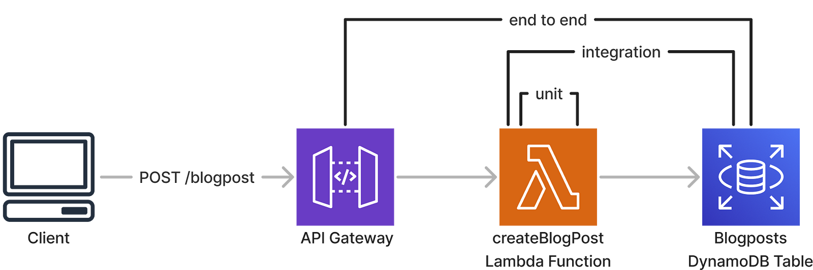

# Overview

This is a side project template on how to effictively test your Serverless applications. We are going to implement a simple REST API and incorporate the techniques and concepts on how to effectively test and develop endpoints with the best developer experience as well as improving code confidence when it a serverless application being shipped to production.



# Prerequisites

1. Configure your AWS profile: `export AWS_PROFILE=<your-profile-name>`
2. Install dependencies: `npm install`
3. Deploy the serverless application: `npm run sls -- deploy --stage <your-ephemeral-environment-name> . Don't forget to change <your-ephemeral-environment-name>to the name of your own ephemeral environment.
4. Create your own `.env.<your-ephemeral-environment-name> .`
   The following are the values of your environment file

```The following are the values of your environment file.
API_BASE_URL=XXX
BLOG_POSTS_TABLE=XXX
AWS_REGION=XXX
```

# Run integration test

1. `export STAGE=<your-ephemeral-environment-name>`. This is to reference your `.env.<your-ephemeral-environment-name>`.
2. `npm run integration-test`

# Run e2e test

1. Deploy the application: `npm run sls -- deploy --stage <your-ephemeral-environment-name>`
2. `npm run e2e-test`
